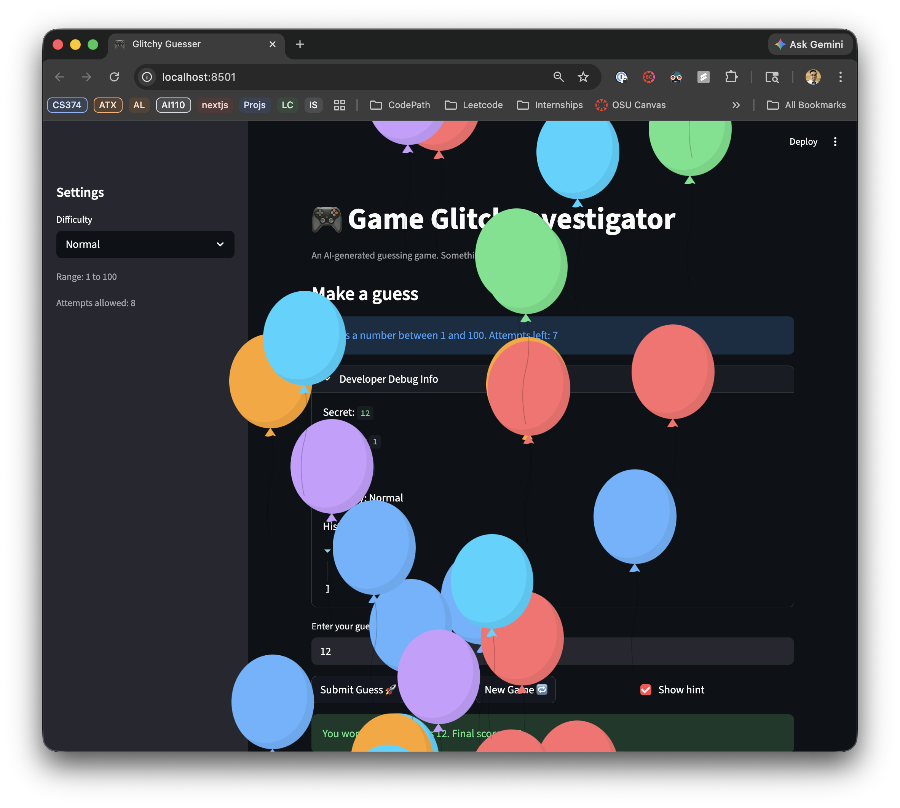
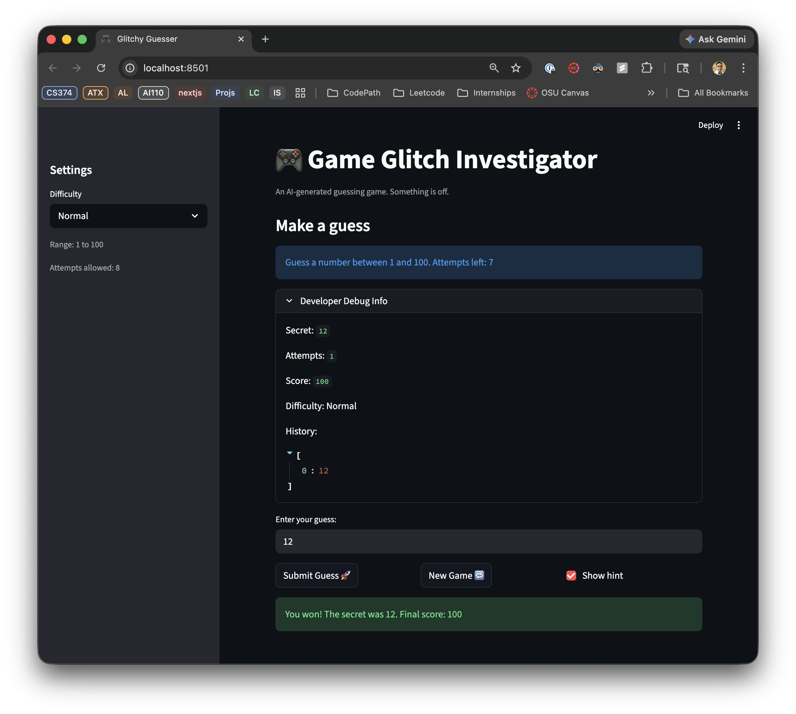

# 🎮 Game Glitch Investigator: The Impossible Guesser

## 🚨 The Situation

You asked an AI to build a simple "Number Guessing Game" using Streamlit.
It wrote the code, ran away, and now the game is unplayable. 

- You can't win.
- The hints lie to you.
- The secret number seems to have commitment issues.

## 🛠️ Setup

1. Install dependencies: `pip install -r requirements.txt`
2. Run the broken app: `python -m streamlit run app.py`

## 🕵️‍♂️ Your Mission

1. **Play the game.** Open the "Developer Debug Info" tab in the app to see the secret number. Try to win.
2. **Find the State Bug.** Why does the secret number change every time you click "Submit"? Ask ChatGPT: *"How do I keep a variable from resetting in Streamlit when I click a button?"*
3. **Fix the Logic.** The hints ("Higher/Lower") are wrong. Fix them.
4. **Refactor & Test.** - Move the logic into `logic_utils.py`.
   - Run `pytest` in your terminal.
   - Keep fixing until all tests pass!

## 📝 Document Your Experience

**Game Purpose**
Glitchy Guesser is a number guessing game built with Streamlit where the player tries to guess a randomly generated secret number within a limited number of attempts. After each guess, the game provides a directional hint and updates a score. The game was intentionally shipped with several bugs to practice debugging, state management, and AI-assisted development.

**Bugs Found**

1. **Attempt counter initialized to 1** — `st.session_state.attempts` was set to `1` on page load, making the game show one used attempt before the player had submitted anything.
2. **Hint messages pointing the wrong direction** — In `check_guess`, the "Too High" and "Too Low" outcomes had their hint messages swapped, so a guess that was too high told the player to go higher and vice versa.
3. **New Game button not clearing history** — Clicking New Game reset the secret and attempt count but left the previous game's guess history intact, since the `if "history" not in st.session_state` guard only runs on a fresh page load.
4. **New Game button not resetting game status** — After a win or loss, `st.session_state.status` was never reset to `"playing"`, so clicking New Game still hit the `st.stop()` gate and blocked any further submissions.
5. **Attempt history not updating until a second interaction** — The Developer Debug Info expander rendered before the submit handler ran, so the history list always showed one step behind. The UI only reflected the latest guess after a second interaction triggered a rerun.
6. **Hints disappearing after submission** — After fixing bug #5 with `st.rerun()`, the hint `st.warning()` call was being wiped before the user could see it, since `st.rerun()` discards all rendered output from the current script execution.
7. **Win balloon animation and result message not displaying** — Same root cause as bug #6: `st.balloons()` and the "You won!" message were rendered inside the submit block and wiped by `st.rerun()` before reaching the user.
8. **First-guess win scoring 80 instead of 100** — The score formula used `attempt_number + 1` instead of `attempt_number - 1`, causing a one-attempt win to score `100 - 20 = 80` rather than the expected `100`.

**Fixes Applied**

- **Bug #1:** Changed `st.session_state.attempts = 1` to `= 0` in the session state initialization block.
- **Bug #2:** Swapped the return messages in `check_guess` so `"Too High"` returns `"Go LOWER!"` and `"Too Low"` returns `"Go HIGHER!"`.
- **Bugs #3 & #4:** Added `st.session_state.history = []` and `st.session_state.status = "playing"` to the New Game handler so both are explicitly reset on every new game.
- **Bug #5:** Added `st.rerun()` at the end of the submit handler so the full script re-executes after state is mutated, causing the debug info to reflect the latest submission immediately.
- **Bug #6:** Stored the hint message in `st.session_state.last_hint` inside the submit handler, then rendered it from session state after the submit block where it survives the rerun.
- **Bug #7:** Introduced `just_won` and `just_lost` flags in session state. The submit handler sets these flags instead of calling `st.balloons()` and `st.success/error` directly. The status check block reads the flags on the next run to show the win/loss UI, then clears them so repeat visits show the "already won/lost" fallback message.
- **Bug #8:** Changed the score formula from `100 - 10 * (attempt_number + 1)` to `100 - 10 * (attempt_number - 1)` so a first-guess win correctly awards 100 points.

## 📸 Demo

## 🚀 Stretch Features

- [ ] [If you choose to complete Challenge 4, insert a screenshot of your Enhanced Game UI here]
 